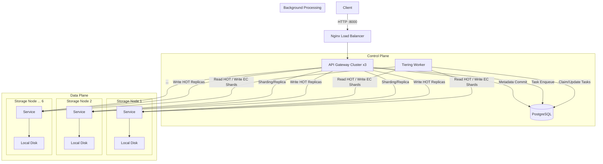

# Replication + Erasure Coding Object Store

Fault-tolerant distributed object storage system written in Go.
The current mainline architecture is PostgreSQL-first:
- foreground writes land in HOT replication
- background workers migrate eligible objects to EC
- metadata and task state are managed in normalized PostgreSQL tables


## Features

- **Replication + EC tiering**
  - **Replication**: low-latency HOT write path.
  - **Erasure Coding (RS 4+2)**: storage-efficient cold tier.
  - **Background tiering**: periodic policy enqueues REPL->EC tasks.
- **PostgreSQL metadata source of truth**
  - object/version/state tracking
  - node heartbeat tracking
  - task queue lifecycle for tiering
- **Admin observability**
  - task list/requeue/cancel
  - object and node metadata inspection


## Architecture

The system is deployed as a microservices cluster via Docker Compose:



### Component Roles

| Service | Scale | Description |
| --- | --- | --- |
| **API Gateway** | 3x | Traffic entry point. Handles foreground writes and v2/admin APIs. |
| **PostgreSQL** | 1x | Metadata and task store (`objects`, `object_versions`, `tiering_tasks`, etc.). |
| **Storage Node** | 6x | Stores object replicas and EC shard blobs. |
| **Tiering Worker** | 1x | Background policy scan + REPL->EC migration processor. |

## Getting Started

### Prerequisites

- Docker
- Docker Compose
- Go 1.24+ (for local development)

### Installation

1. **Clone the repository**
    
    ```
    cd Replication_ErasureCoding_Object_Store
    ```
    
2. **Start the Cluster**
    
    The system utilizes Init Containers to handle all setup tasks (e.g., Topic creation).
    
    ```
    docker-compose up --build
    ```
    
3. **Verify Status**
The API Gateway is exposed at `http://localhost:8000`.
    
    ```
    curl http://localhost:8000/health
    # Output: {"status":"healthy","service":"api_gateway"...}
    ```
    

## Usage Guide

### 1. Upload Data (Write)

You can choose a storage strategy via the `strategy` query parameter.

**Option A: Erasure Coding (For large files)**

```
curl -X POST "http://localhost:8000/write?key=image.png&strategy=ec" \
     -H "Content-Type: application/json" \
     -d '{"binary_data": "..."}'
```

**Option B: Replication (For critical data)** Best for small, critical data that requires low latency. Stores full copies on 3 nodes.

```
curl -X POST "http://localhost:8000/write?key=config:settings&strategy=replication" \
     -H "Content-Type: application/json" \
     -d '{"theme": "dark", "notifications": true}'
```

### 2. Retrieve Data (Read)

Simply request the key. The system automatically resolves the strategy, retrieves shards/replicas, reconstructs the data, and returns the original JSON.

```
curl http://localhost:8000/read/user:1001
```

### 3. Delete Data

Deletes both metadata and physical data.

```
curl -X DELETE http://localhost:8000/delete/user:1001
```

## Configuration

Key system parameters are defined in `internal/config/config.go`.

| Parameter | Default | Description |
| --- | --- | --- |
| `K` | 4 | Number of Data Shards (Reed-Solomon). |
| `M` | 2 | Number of Parity Shards. |
| `HOT_WRITE_QUORUM` | `2` | Minimum replica acknowledgements required before foreground write ACK. |

## Testing

Simple integration tests are provided in the `test/` directory.

**Run the functional test suite:**
This script verifies active strategies (Replication, EC) and edge cases (invalid inputs, deletes).

```
python3 test/simple_test.py
```


### Storage Efficiency 

The system significantly reduces storage overhead for large objects. We use test/verify_storage_docker.py to measure the Storage Amplification Factor across 6 storage nodes using a realistic IoT scenario.

### Payload (IoT Telemetry)

The test writes JSON objects with mixed small fields and one large payload field:

```
{
  "device_id": "sensor-gh-0001",
  "battery_level": 85,
  "status_code": 200,
  "is_active": true,
  "last_sync_ts": 1734842400,
  "firmware_version": "v2.4.1",
  "sensor_raw_log": "xxxx..."
}
```

**Run the verification:**

```
python3 test/verify_storage.py
```

**Measured Results (IoT Telemetry Scenario):**
| Strategy | Overhead | 
| --- | --- |
| **Replication** | **3.0000x** | 
| **Erasure Coding** | **1.5000x** | 


## Project Structure

```
.
├── cmd/                       # Entry points
│   ├── api/                   # API Gateway (Main Entry)
│   └── storage_node/          # Async I/O Data Node
├── internal/                  # Private library code
│   ├── config/                # Configuration constants
│   ├── ec/                    # Reed-Solomon wrapper
│   ├── httpclient/            # Connection pooling client
│   ├── interfaces/            # Interface definitions
│   ├── monitoringservice/     # Node status logic
│   ├── readservice/           # Read path logic
│   ├── storageops/            # Low-level operations
│   ├── utils/                 # Hashing & Serialization Tools
│   └── writeservice/          # Write path logic (replication + EC)
├── docs/                      # Documentation
├── test/                      # Legacy Python tests
├── benchmark.js               # K6 Performance Test Suite
├── docker-compose.yaml        # Container orchestration
└── nginx.conf                 # Load balancer config

```
