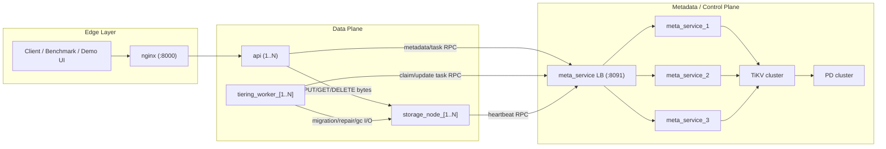
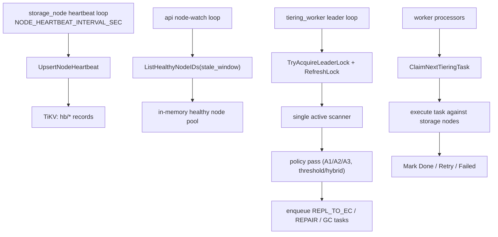

# Load-Aware Tiered Object Storage (Replication + Erasure Coding)

Distributed object storage in Go focused on one core question:
how to move objects from replication to erasure coding with minimal foreground impact under resource constraints.

This repository is not only a storage implementation; it is also an experimental platform for comparing tiering policies:
- `Strategy A` (time-based baseline): periodic migration with A1/A2/A3 variants
- `Strategy B` (static throttling): fixed migration budgets/concurrency caps
- `Strategy C` (idle-window gating): migrate only when cluster load remains below safety thresholds for N consecutive checks

Core system characteristics:
- replication-first HOT writes for predictable low-latency foreground path
- background `REPL -> EC` migration for storage-efficiency optimization
- TiKV-backed metadata/task orchestration through `meta_service`
- reproducible smoke/ops scripts for validation and policy comparison

## Summary

The system stores binary objects with two tiers:
HOT data is synchronously replicated for fast writes/reads, and colder data is asynchronously promoted to EC shards.
Policy scanners and workers continuously evaluate migration eligibility and execute tasks with backpressure and safety controls.

The design target is to let us evaluate policy quality (latency, throughput, space, recovery behavior), not only feature correctness.

Primary object API:
- `PUT /v2/objects/:id`
- `GET /v2/objects/:id`
- `DELETE /v2/objects/:id`

Demo UI:
- `/demo/`

## System Architecture



Default deployment cardinality (from `docker-compose.yaml`):

| Service | Default profile | HA overlay (`docker-compose.ha.yaml`) |
|---|---|---|
| `nginx` | 1 | 1 |
| `api` | 1 (scalable) | 1..N |
| `storage_node` | 6 | 6..N |
| `tiering_worker` | 1 (scalable) | 1..N |
| `meta_service` | 3 replicas + 1 LB | 3 replicas + 1 LB |
| `PD` | 1 | 3 |
| `TiKV` | 1 | 3 |

Runtime control loops:



Metadata domains (TiKV keyspaces):

| Prefix | Domain | Purpose |
|---|---|---|
| `obj/` | object head | current version pointer and object state (`HOT_ACTIVE`, `MIGRATION_PENDING`, `EC_ACTIVE`, etc.) |
| `objv/` | object versions | immutable version records (`tier`, `size`, checksum, encoding params) |
| `repl/` | replica locations | HOT replica node mappings and status |
| `ec/` | EC shard locations | shard index to node/path mapping and status |
| `task/` | background task queue | `REPL_TO_EC`, `REPAIR`, `GC` lifecycle (`PENDING/RUNNING/DONE/RETRY_WAIT/FAILED`) |
| `tdue/`, `tdue_ref/` | due-index | event-driven migration eligibility index (scanner reads this instead of full object scan) |
| `hb/` | node heartbeats | node liveness/load snapshots for discovery and threshold gating |
| `leader/`, `leader_lock/` | scanner leadership | distributed lock and leader-state observability |

Component responsibilities:

| Component | Responsibility |
|---|---|
| `nginx` | Single external entrypoint and routing to API. |
| `api` | Foreground PUT/GET/DELETE path; writes HOT replicas; reads HOT/EC; commits metadata. |
| `storage_node` | Stores raw object bytes (HOT replicas and EC shard files). |
| `tiering_worker` | Leader-scanner + task processors for `REPL_TO_EC`, repair, and old-version GC. |
| `meta_service` | RPC façade for metadata operations, task queue, heartbeats, and leader lock semantics. |
| `TiKV` | Durable distributed KV for metadata records and queue state. |
| `PD` | TiKV timestamp/placement coordinator. |

## End-to-End Flows

### PUT Flow
1. Client sends binary body to `PUT /v2/objects/:id`.
2. API picks HOT replica targets.
3. API writes object bytes to storage nodes.
4. API requires quorum (`HOT_WRITE_QUORUM`).
5. API commits metadata and object version via `meta_service`.
6. Tiering task is enqueued now or selected by scanner (config-dependent).

### GET Flow
1. Client requests `GET /v2/objects/:id`.
2. API loads object metadata to determine current tier/state.
3. If object is HOT or migrating, API reads from replica path.
4. If object is EC_ACTIVE, API reads shards and reconstructs bytes.
5. API returns binary response with stored `content_type` (fallback: `application/octet-stream`).

### DELETE Flow
1. Client calls `DELETE /v2/objects/:id`.
2. API reads metadata and decides deletion path by strategy/tier.
3. API removes physical blobs from corresponding storage nodes.
4. API deletes normalized metadata entry.
5. API returns deletion result summary.

## Tiering Strategies

Tiering is the main research axis of this project: we keep data-plane logic fixed and compare policy behavior under identical workloads.

Policy family:

1. `Strategy A` (time-based baseline)
- `A1`: age-only (`AGE_THRESHOLD_SEC`)
- `A2`: age + size (`AGE_THRESHOLD_SEC` + `SIZE_THRESHOLD_BYTES`)
- `A3`: age + budget cap (`MAX_OBJECTS_PER_ROUND`, `MAX_BYTES_PER_ROUND`)

2. `Strategy B` (static throttling)
- fixed execution budgets and worker limits (`MAX_OBJECTS_PER_ROUND`, `MAX_BYTES_PER_ROUND`, `WORKER_MAX_CONCURRENCY`, `WORKER_BW_LIMIT_MBPS`)
- goal: constrain migration impact even when candidate set is large

3. `Strategy C` (idle-window gating)
- threshold scanner samples node heartbeats (`cpu`, `memory`, `disk iowait`, `io queue depth`, optional disk pressure)
- migration is allowed only after `IDLE_STABLE_ROUNDS` consecutive idle samples
- any over-threshold sample resets stability counter immediately

Trigger modes:
- `periodic`: time-driven scans every `TIERING_PERIOD_SEC`
- `threshold`: pressure/idle-window-driven scans every `TIERING_THRESHOLD_CHECK_SEC`
- `hybrid`: periodic baseline plus threshold-triggered extra passes

Execution model:

1. Foreground write records/updates due-index eligibility (`tdue/*`).
2. Scanner selects ready candidates and enqueues deterministic task IDs (`repl2ec:{object}:{version}`).
3. Workers claim tasks with optimistic concurrency and process them idempotently.
4. Task outcomes are persisted as `DONE`, `RETRY_WAIT`, or `FAILED` with retry metadata.
5. Result metrics are exposed through admin endpoints for policy comparison runs.

## API Quick Reference

### Object APIs
```bash
# PUT
printf 'hello-v2\n' > /tmp/payload.bin
curl -sS -X PUT \
  'http://127.0.0.1:8000/v2/objects/demo-001' \
  -H 'Content-Type: application/octet-stream' \
  --data-binary @/tmp/payload.bin

# GET
curl -sS 'http://127.0.0.1:8000/v2/objects/demo-001' -o /tmp/out.bin

# DELETE
curl -sS -X DELETE 'http://127.0.0.1:8000/v2/objects/demo-001'
```

### Admin APIs
```bash
curl -sS 'http://127.0.0.1:8000/health'
curl -sS 'http://127.0.0.1:8000/v2/admin/nodes?limit=20'
curl -sS 'http://127.0.0.1:8000/v2/admin/tasks?limit=50'
curl -sS 'http://127.0.0.1:8000/v2/admin/objects/demo-001'
curl -sS 'http://127.0.0.1:8000/v2/admin/leader'
curl -sS 'http://127.0.0.1:8000/v2/admin/metrics-snapshot'
```

## Run and Demo

### Start
```bash
docker compose -f docker-compose.yaml up -d --build
```

### Health check
```bash
curl -sS http://127.0.0.1:8000/health
```

### Demo UI
```text
http://127.0.0.1:8000/demo/
```

### Stop
```bash
docker compose -f docker-compose.yaml down
```

## Smoke Tests

```bash
# End-to-end v2 path (write -> task -> EC -> read)
START_STACK=true ./scripts/smoke_e2e_v2.sh

# Scanner leader failover (requires 2 workers in script startup)
START_STACK=true ./scripts/smoke_leader_failover.sh

# Threshold idle-window behavior
START_STACK=true ./scripts/smoke_policy_idle_window.sh

# Matrix runner
./scripts/smoke_matrix.sh
```

## Repository Map

```text
cmd/
  api/             API gateway (v2, admin, demo UI)
  storage_node/    data node service
  tiering_worker/  scanner + migration/repair/gc processors
  meta_service/    metadata RPC service

internal/
  meta/            TiKV store, keyspace, metadata/task primitives
  writeservice/    foreground write orchestration
  readservice/     replication and EC read path
  tiering/         background task processors
  storageops/      deletion/storage operations
  config/          env-driven runtime configuration

scripts/
  smoke_*.sh       integration and failover smoke scripts
```
