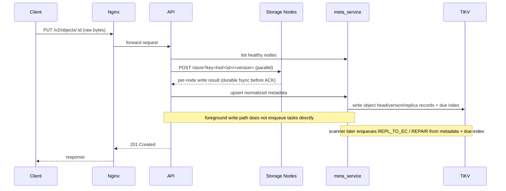
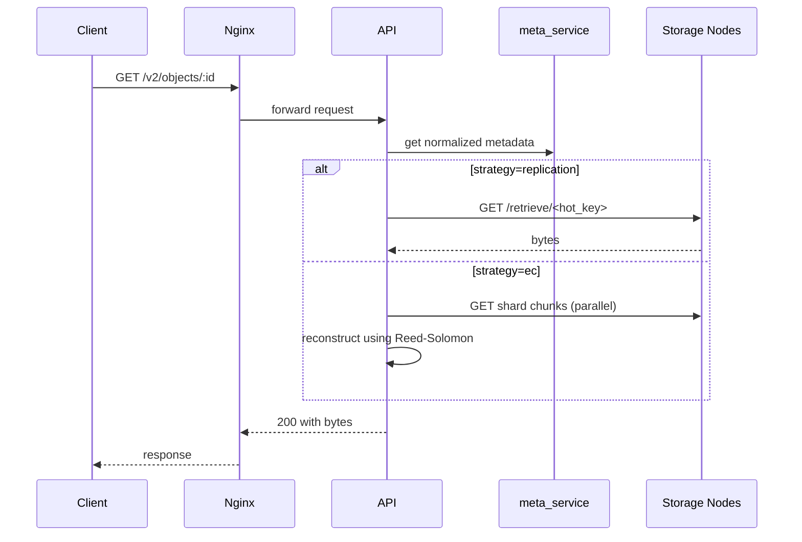

# Explanation: Request and Task Lifecycles

This document maps runtime paths to concrete code locations.

For a deeper and strictly step-by-step tiering path from metadata insert to worker claim, see:

1. [Tiering Task Path from PUT to Worker Claim](tiering-task-path-from-put-to-worker-claim.md)
2. [Tiering Policy Strategies and Trigger Modes](tiering-policy-strategies-and-trigger-modes.md)

## 1. PUT Lifecycle (`PUT /v2/objects/:id`)

Primary code:

1. route: [`cmd/api/main.go`](../../cmd/api/main.go) (`registerV2ObjectRoutes`)
2. write logic: [`internal/writeservice/writeservice.go`](../../internal/writeservice/writeservice.go)
3. metadata commit: [`internal/meta/tikv_store_objects.go`](../../internal/meta/tikv_store_objects.go)

### 1.1 Sequence

### 1.2 Invariants

1. API ACK requires write quorum success (`HOT_WRITE_QUORUM`).
2. Metadata commit occurs after quorum success.
3. Each write creates a new version id (`hot_version`).
4. Partial replica success is marked (`is_dirty=true`), and repair is scanner-enqueued later.

### 1.3 Why this shape

1. foreground path stays small and predictable.
2. expensive EC conversion deferred to background workers.

## 2. GET Lifecycle (`GET /v2/objects/:id`)

Primary code:

1. route: [`cmd/api/main.go`](../../cmd/api/main.go)
2. metadata lookup: `loadMetadata(...)`
3. reads: [`internal/readservice/readservice.go`](../../internal/readservice/readservice.go)

### 2.1 Sequence

### 2.2 Key details

1. GET does not require client to provide version.
2. current version resolved from metadata head.
3. content type returned from metadata if available.

## 3. DELETE Lifecycle (`DELETE /v2/objects/:id`)

Primary code:

1. route: [`cmd/api/main.go`](../../cmd/api/main.go)
2. storage delete helpers: `internal/storageops/*`
3. metadata delete: `DeleteNormalizedMetadata`

### 3.1 Sequence

1. resolve metadata by object id
2. branch by strategy
3. delete physical data from storage nodes
4. remove metadata records (object/version/placements/due index)

## 4. Background Tiering Lifecycle (`REPL_TO_EC`)

Primary code:

1. claim loop: [`internal/tiering/worker.go`](../../internal/tiering/worker.go)
2. processor: [`internal/tiering/repl_to_ec_processor.go`](../../internal/tiering/repl_to_ec_processor.go)
3. metadata transition: [`internal/meta/tikv_store_migration.go`](../../internal/meta/tikv_store_migration.go)

### 4.1 Processing steps

1. claim runnable task
2. load object version snapshot
3. reject stale task if `task.version != current_version`
4. mark object `MIGRATING`
5. fetch source bytes from active replicas
6. split+encode shards (k,m)
7. write shards to nodes
8. promote metadata tier to `EC_ACTIVE`
9. enqueue replication GC task

## 5. Repair Lifecycle (`REPAIR`)

Primary code: [`internal/tiering/repair_replication_processor.go`](../../internal/tiering/repair_replication_processor.go)

### 5.1 HOT repair

1. detect active replica count below target
2. fetch source bytes from existing active replica
3. write missing replicas to candidate healthy nodes
4. upsert repaired placements

### 5.2 EC repair

1. read admin view for current EC version
2. detect missing shards
3. reconstruct from available shards
4. write missing shards
5. persist repaired EC locations

## 6. Old-Version GC Lifecycle (`GC_OLD_VERSION`)

Primary code:

1. candidate enqueue: [`internal/meta/tikv_store_old_version_gc.go`](../../internal/meta/tikv_store_old_version_gc.go)
2. execution: [`internal/tiering/old_version_gc_processor.go`](../../internal/tiering/old_version_gc_processor.go)

### 6.1 Rules

1. never purge current version
2. keep latest N versions (`OLD_VERSION_RETENTION_COUNT`)
3. keep versions newer than age threshold (`OLD_VERSION_RETENTION_AGE_SEC`)

### 6.2 Steps

1. delete old blobs/shards
2. purge old version metadata records
3. remove due-index references for purged versions

## 7. Leader and Scanner Lifecycle

Primary code:

1. lock loop: [`cmd/tiering_worker/main.go`](../../cmd/tiering_worker/main.go)
2. lock impl: [`internal/meta/kvstore/client.go`](../../internal/meta/kvstore/client.go)

### 7.1 Behavior

1. many workers can run
2. only lock owner runs scanner
3. lock ping failure stops scanner immediately
4. workers retry leadership acquisition

## 8. Failure Semantics Summary

1. foreground failure: request fails fast, no silent ACK.
2. background failure: task transitions to `RETRY_WAIT` with backoff.
3. retry cap reached: task becomes `FAILED`.
4. stale tasks: skipped safely.
