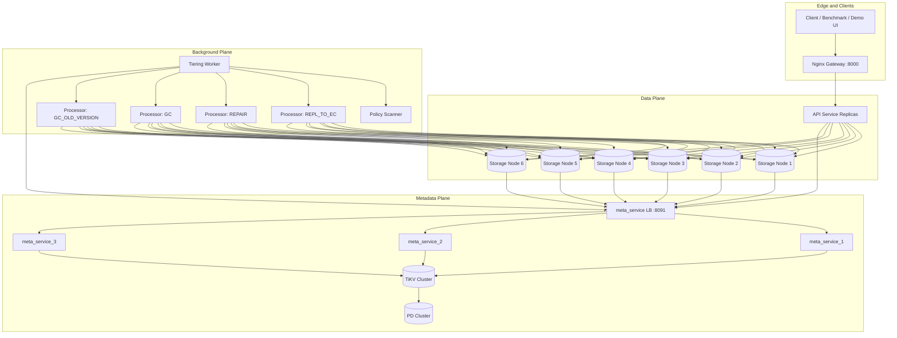

# Explanation: System Architecture

This document explains the full runtime architecture and why each layer exists.

## 1. Architecture at a Glance

## 2. Core Design Split

1. Foreground path (`PUT/GET/DELETE`) prioritizes predictable latency and availability.
2. Background path handles expensive transitions (tiering, repair, garbage collection).
3. Metadata plane is isolated behind `meta_service` RPC boundary.

## 3. Request Path Summary

### 3.1 PUT `/v2/objects/:id`

1. API chooses HOT replicas.
2. Writes bytes to storage nodes.
3. Requires write quorum.
4. Persists normalized metadata.
5. Persists due-index records for future background selection.
6. Returns ACK without directly enqueuing tiering/repair tasks.

### 3.2 GET `/v2/objects/:id`

1. API reads metadata strategy/tier/version.
2. If HOT path, fetches one healthy replica.
3. If EC path, reconstructs payload from shards.

### 3.3 DELETE `/v2/objects/:id`

1. API resolves current placements.
2. Deletes physical data.
3. Cleans metadata records.

### 3.4 Background Enqueue Boundary

1. Foreground write path commits object/version/placement metadata and due-index only.
2. Policy scanner later enqueues `REPL_TO_EC` and `REPAIR` from metadata state.
3. Processors enqueue follow-up tasks (for example replication `GC`) after state transitions.

## 4. Metadata Ownership Model

1. API, storage nodes, and workers never talk to TiKV directly in normal runtime profile.
2. They call `meta_service` via RPC (`/meta/rpc`).
3. `meta_service` translates RPC methods to repository operations.
4. Repository implementation persists records in TiKV keyspaces.

## 5. Why This Layering Exists

1. API remains independent from backend metadata technology details.
2. Lock and metadata semantics are centralized.
3. Multi-component code can share one repository contract (`internal/meta/repository.go`).
4. Failure handling is easier to reason about when state machine is centralized.
