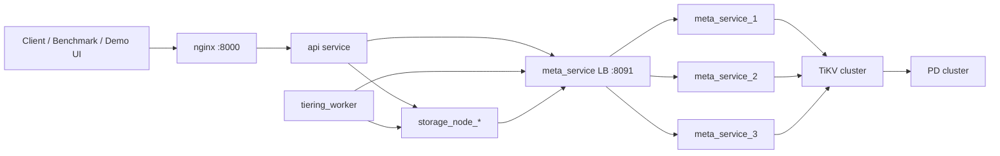

# System Dependencies

## 1. Runtime Dependency Graph

## 2. Inbound Dependencies

1. external clients call nginx (`:8000`)
2. internal services call metadata RPC (`/meta/rpc`)
3. API/worker call storage node internal HTTP APIs

## 3. Outbound Dependencies

1. API -> meta_service RPC
2. tiering_worker -> meta_service RPC
3. storage_node heartbeat -> meta_service RPC
4. meta_service -> TiKV client-go -> PD/TiKV

## 4. Compose Profiles

### 4.1 Functional profile

File: [`docker-compose.yaml`](../../docker-compose.yaml)

1. 1 PD
2. 1 TiKV
3. 3 meta_service replicas + LB
4. 6 storage nodes
5. API
6. tiering worker
7. nginx

### 4.2 HA metadata profile

Files: `docker-compose.yaml + docker-compose.ha.yaml`

1. 3 PD
2. 3 TiKV
3. same upper-layer services

## 5. Key Go Module Dependencies

1. `github.com/gin-gonic/gin` for HTTP API/server
2. `github.com/klauspost/reedsolomon` for EC encoding/decoding
3. `github.com/tikv/client-go/v2` for TiKV transactional KV client
