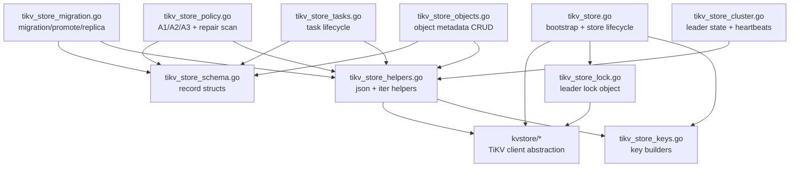

# `internal/meta` (TiKV-first Metadata Layer)

This package is the metadata/control-plane backend used by API, tiering worker, and storage nodes.

## File layout

- `store.go`
  - backend selector (`tikv` / `rpc`)
  - shared interfaces (`Repository`, `MetaStore`)
- `tikv_store.go`
  - TiKV store bootstrap and lifecycle (`NewTiKVStore`, `Ping`, `Close`)
  - leader lock acquire entry (`TryAcquireLeaderLock`)
- `tikv_store_lock.go`
  - leader lock object (`tiKVLeaderLock`)
  - lock owner token generation
  - lock keepalive/release (`Ping`, `Release`)
- `tikv_store_keys.go`
  - key builders/prefix helpers (`tiKVObjectKey`, `tiKVTaskKey`, ...)
  - ordered key encoders and prefix upper-bound helper
- `tikv_store_schema.go`
  - key-prefix constants (`obj/`, `objv/`, `repl/`, ...)
  - internal TiKV record structs (`tiKVObjectRecord`, `tiKVTaskRecord`, ...)
- `tikv_store_objects.go`
  - object metadata CRUD (`Upsert/Get/DeleteNormalizedMetadata`)
  - admin object detail view (`GetObjectAdminView`)
- `tikv_store_tasks.go`
  - task queue lifecycle (`Enqueue`, `Claim`, `Done/Retry/Failed`, admin task APIs)
- `tikv_store_policy.go`
  - periodic policy scanners (A1/A2/A3)
  - repair candidate scan/enqueue logic
- `tikv_store_migration.go`
  - migration state transitions and EC promotion commit
  - replica location read/write updates
- `tikv_store_cluster.go`
  - tiering leader state persistence
  - node heartbeat upsert/query
- `tikv_store_helpers.go`
  - internal iterators/json encode/decode helpers
- `kvstore/`
  - TiKV/Pebble-compatible client abstraction (`Client`, `Batch`, `Iterator`)

## Module graph

## Data flow (high level)

1. API `PUT` writes payload to storage nodes, then calls `UpsertNormalizedMetadata`.
2. Policy scanner (`EnqueueTieringCandidatesA1/A2/A3`) creates `REPL_TO_EC` tasks.
3. Worker claims task (`ClaimNextTieringTask`), marks object migrating, writes shards.
4. Worker commits EC promotion with `PromoteObjectVersionToEC`.
5. Repair scanner (`EnqueueRepairCandidates`) creates `REPAIR` tasks when replicas/shards are below target.
6. Storage nodes keep heartbeats fresh via `UpsertNodeHeartbeat`; API reads healthy nodes with `ListHealthyNodeIDs`.

## Concurrency model

- TiKV store methods use store-level `mu` (`sync.RWMutex`) to keep multi-key state transitions deterministic.
- Multi-record updates use `Batch` + single commit where atomicity matters (for example EC promotion).

## Guardrails

- Do not add PostgreSQL/etcd metadata paths in this package.
- New metadata features should be added to a focused file instead of growing `tikv_store.go`.
